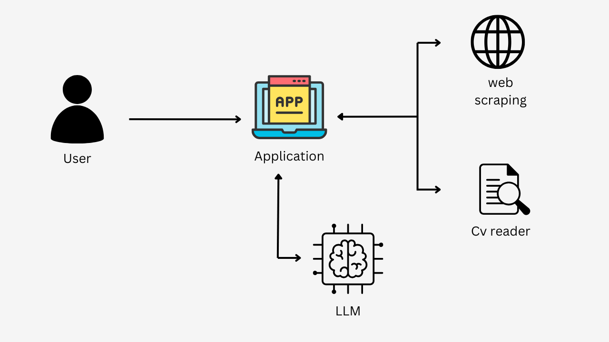

# Cover Letter Generator

This is a Python-based Cover Letter Generator application that uses PDF reading and web scraping to craft a personalized cover letter. Users can paste a job posting web page link and upload their CV. The app processes the details from the CV and the job posting to generate a customized cover letter.

## Features
- **Job Posting Analysis**: Extracts job requirements from a pasted URL of a job posting.
- **CV Parsing**: Reads and analyzes the user's CV to identify relevant skills and experiences.
- **Cover Letter Generation**: Combines the extracted information to create a tailored cover letter.
- **Simple User Interface**: Easy-to-use interface for uploading CVs and pasting job links.

## Application Flow
Below is the high-level application flow of the Cover Letter Generator:



## Demo
Here is a GIF demonstrating the application's functionality:


## Technologies Used
- **Python**: Core language for application development.
- **Streamlit**: For creating the user interface.
- **LangChain Community Document Loaders**: For extracting information from job posting web pages and PDFs.
- **FPDF**: For generating the final cover letter as a PDF.
- **ChatGroq**: Used for generating responses based on prompts.
- **PromptTemplate & JsonOutputParser**: For constructing and parsing outputs from the ChatGroq model.
- **dotenv**: For managing environment variables.

## Installation

1. **Clone the repository:**
   ```bash
   git clone https://github.com/your-username/cover-letter-generator.git
   cd cover-letter-generator
   ```

2. **Set up a virtual environment:**
   ```bash
   python -m venv venv
   source venv/bin/activate  # On Windows, use `venv\Scripts\activate`
   ```

3. **Install the required packages:**
   ```bash
   pip install -r requirements.txt
   ```

4. **Create a `.env` file:**
   Add your necessary environment variables in a `.env` file for secure configuration.

5. **Run the application:**
   ```bash
   streamlit run app.py
   ```

6. Open your browser and navigate to the displayed Streamlit URL to use the application.

## Usage
1. Paste the URL of the job posting in the designated field.
2. Upload your CV in PDF format.
3. Click the "Generate Cover Letter" button.
4. Download the generated cover letter.

## Directory Structure
```
cover-letter-generator/
├── app/
│   ├── chains.py/
│   ├── cv_reader.py/
│   ├── main.py/
│   ├── utils.py/
│   ├── .env
├── Cover Letter Builder.ipynb
```

## Contributing
Contributions are welcome! Feel free to fork this repository and submit a pull request.

## License
This project is licensed under the MIT License. See the LICENSE file for details.

## Contact
For any questions or feedback, please contact:
- **GitHub**: [NuwanSubasingha99](https://github.com/NuwanSubasingha99)
